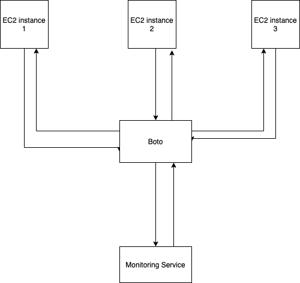

#aws monitoring project
1. User management, different user can register themselves and add the instance they willto monitor
2. User can set interval after which CPU Usage should be recorded in the database, createan endpoint exposing this data in an appropriate format, so it can be used to constructgraphs
3. User can choose threshold for CPU Usage individually for each instance crossing whichour system should send an email to user. ( Use DB triggers )
4. User can halt the monitoring service for any instance or remove the instance from thelist
###structure
- aws_monitoring python module to fetch ec2 instance info 
- dockerflask app handling user data and user usnig MongoDB
### Exposed endpoints
- /user POST :- used to create a user instance
- /user/login POST :- used to return a JWT access token
- /instances POST :- used to subscribe the user to the ec2 instances he wants to listen
- /instances GET :- gives the metrices of the user subscribed to ec2 instances
 

###Technologies
- Flask
- MongoDB
- boto3(python lib)
- aws ec2
- aws Cloudwatch

